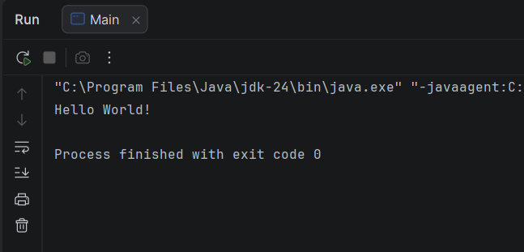
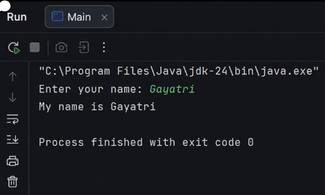
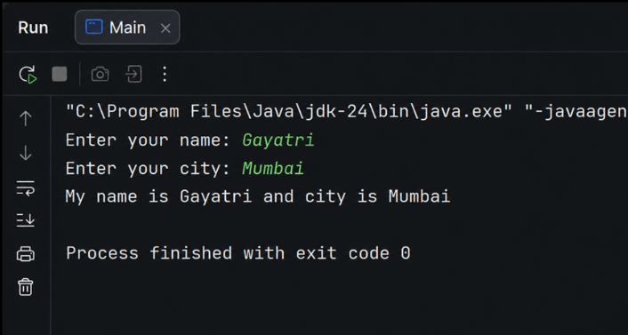

# Web Services Practical 1

**Name:** Gayatri Kanodia\
**Roll No.:** 31010924802\
**Class:** TYIT\
**Subject:** Web Services (Practical)

## Practical 1

### Aim

To write and execute basic Java programs using the `Scanner` class for
input and display output.

------------------------------------------------------------------------

## A) Hello World

### Program

``` java
import java.util.*;

public class helloworld {
    public static void main(String[] args) {
        Scanner sc = new Scanner(System.in);
        System.out.println("Hello world ");
    }
}
```

### Output



------------------------------------------------------------------------

## B) Name Input

### Program

``` java
import java.util.*;

class ws {
    public static void main(String[] args) {
        Scanner sc = new Scanner(System.in);
        System.out.print("Enter your name: ");
        String name = sc.nextLine();
        System.out.println("Hello, " + name);
    }
}
```

### Output



------------------------------------------------------------------------

## C) Name and City

### Program

``` java
import java.util.*;

class name_city {
    public static void main(String[] args) {
        Scanner sc = new Scanner(System.in);
        System.out.print("Enter your name: ");
        String name = sc.nextLine();
        System.out.println("Enter your city :");
        String city = sc.nextLine();
        System.out.println("Hello, " + name + " you live in :" + city);
    }
}
```

### Output


