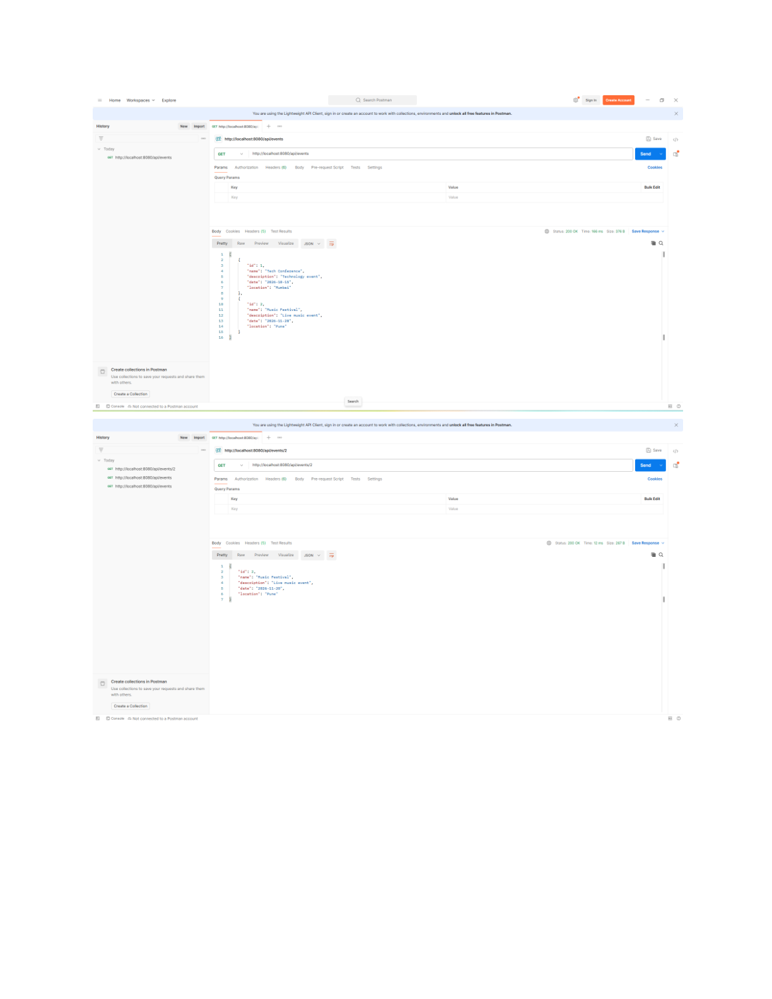
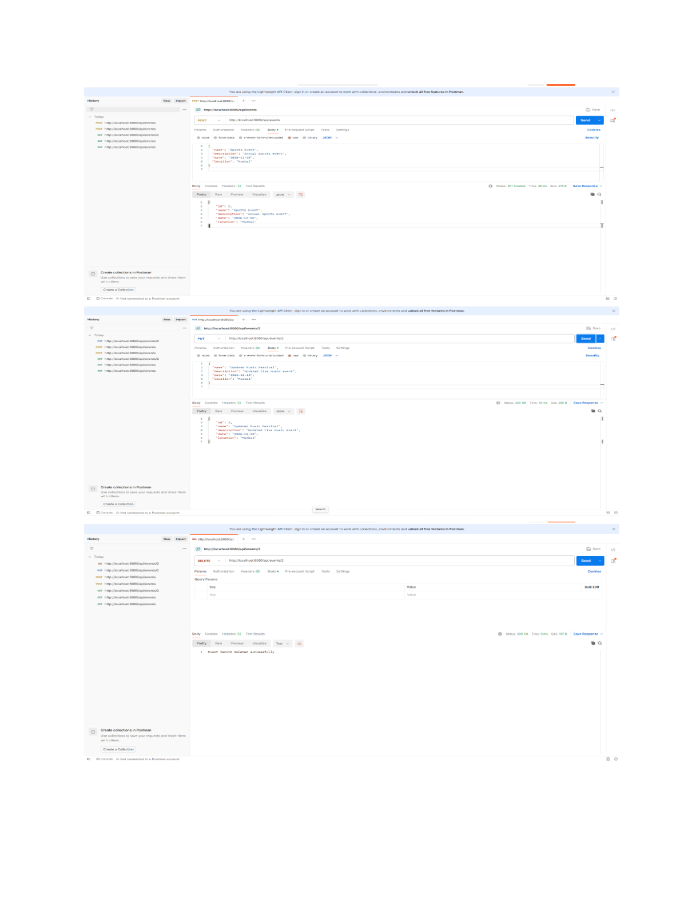

# Web Services – Practical 10

**Name:** Gayatri Kanodia  
**Roll No.:** 31010924802  
**Class:** TYIT  
**Subject:** Web Services (Practical)

## Practical 10

### Aim
To create an Event Management RESTful Web Service using Spring Boot with CRUD operations.

## 1. Event.java

```java
// Event.java
package com.example.eventmgmt;

public class Event {
    private Long id;
    private String name;
    private String description;
    private String date;
    private String location;

    public Event() {
    }

    public Event(Long id, String name, String description, String date, String location) {
        this.id = id;
        this.name = name;
        this.description = description;
        this.date = date;
        this.location = location;
    }

    public Long getId() {
        return id;
    }

    public void setId(Long id) {
        this.id = id;
    }

    public String getName() {
        return name;
    }

    public void setName(String name) {
        this.name = name;
    }

    public String getDescription() {
        return description;
    }

    public void setDescription(String description) {
        this.description = description;
    }

    public String getDate() {
        return date;
    }

    public void setDate(String date) {
        this.date = date;
    }

    public String getLocation() {
        return location;
    }

    public void setLocation(String location) {
        this.location = location;
    }
}
```

## 2. EventController.java


```text
/api/events
```

```java
// EventController.java
package com.example.eventmgmt;

import org.springframework.http.HttpStatus;
import org.springframework.http.ResponseEntity;
import org.springframework.web.bind.annotation.*;

import java.util.ArrayList;
import java.util.List;

@RestController
@RequestMapping("/api/events")
public class EventController {

    private final List<Event> events = new ArrayList<>();

    public EventController() {
        events.add(new Event(
            1L,
            "Tech Conference",
            "Technology event",
            "2026-10-15",
            "Mumbai"
        ));

        events.add(new Event(
            2L,
            "Music Festival",
            "Live music event",
            "2026-11-20",
            "Pune"
        ));
    }

    // GET /api/events
    @GetMapping
    public ResponseEntity<List<Event>> getAllEvents() {
        return ResponseEntity.ok(events);
    }

    // GET /api/events/2
    @GetMapping("/{id}")
    public ResponseEntity<Event> getEventById(@PathVariable Long id) {
        for (Event event : events) {
            if (event.getId().equals(id)) {
                return ResponseEntity.ok(event);
            }
        }

        return ResponseEntity.notFound().build();
    }

    // POST /api/events
    @PostMapping
    public ResponseEntity<Event> addEvent(@RequestBody Event event) {
        long newId = events.stream()
                .mapToLong(Event::getId)
                .max()
                .orElse(0) + 1;

        event.setId(newId);
        events.add(event);

        return ResponseEntity
                .status(HttpStatus.CREATED)
                .body(event);
    }

    // PUT /api/events/2
    @PutMapping("/{id}")
    public ResponseEntity<Event> updateEvent(
            @PathVariable Long id,
            @RequestBody Event updatedEvent) {

        for (Event event : events) {
            if (event.getId().equals(id)) {

                event.setName(updatedEvent.getName());
                event.setDescription(updatedEvent.getDescription());
                event.setDate(updatedEvent.getDate());
                event.setLocation(updatedEvent.getLocation());

                return ResponseEntity.ok(event);
            }
        }

        return ResponseEntity.notFound().build();
    }

    // DELETE /api/events/4
    @DeleteMapping("/{id}")
    public ResponseEntity<String> deleteEvent(@PathVariable Long id) {

        for (Event event : events) {
            if (event.getId().equals(id)) {
                events.remove(event);

                return ResponseEntity.ok(
                        "Event record deleted successfully"
                );
            }
        }

        return ResponseEntity.notFound().build();
    }
}
```

## Initial Events

The application contains these two initial events:

| ID | Name | Description | Date | Location |
|---|---|---|---|---|
| 1 | Tech Conference | Technology event | 2026-10-15 | Mumbai |
| 2 | Music Festival | Live music event | 2026-11-20 | Pune |

## Output

### Postman Output 1



### Postman Output 2



## Result

The Event Management REST API was implemented using Spring Boot with GET, POST, PUT, and DELETE operations.
