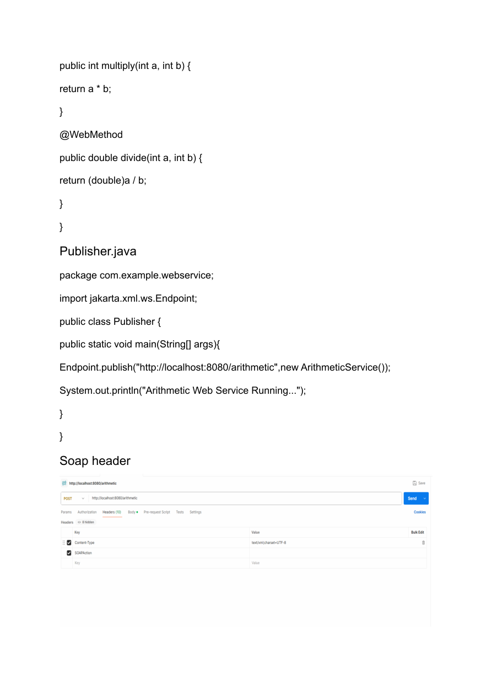
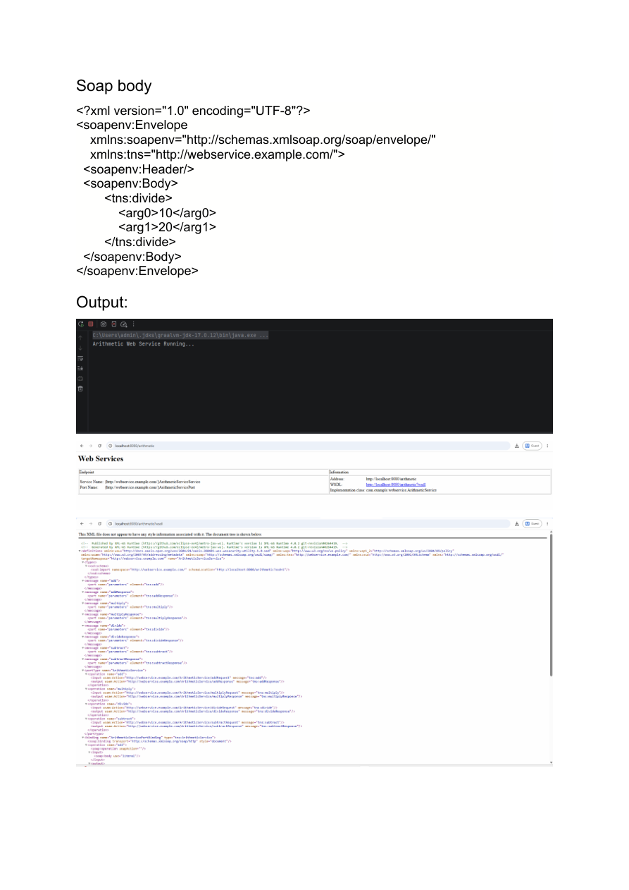
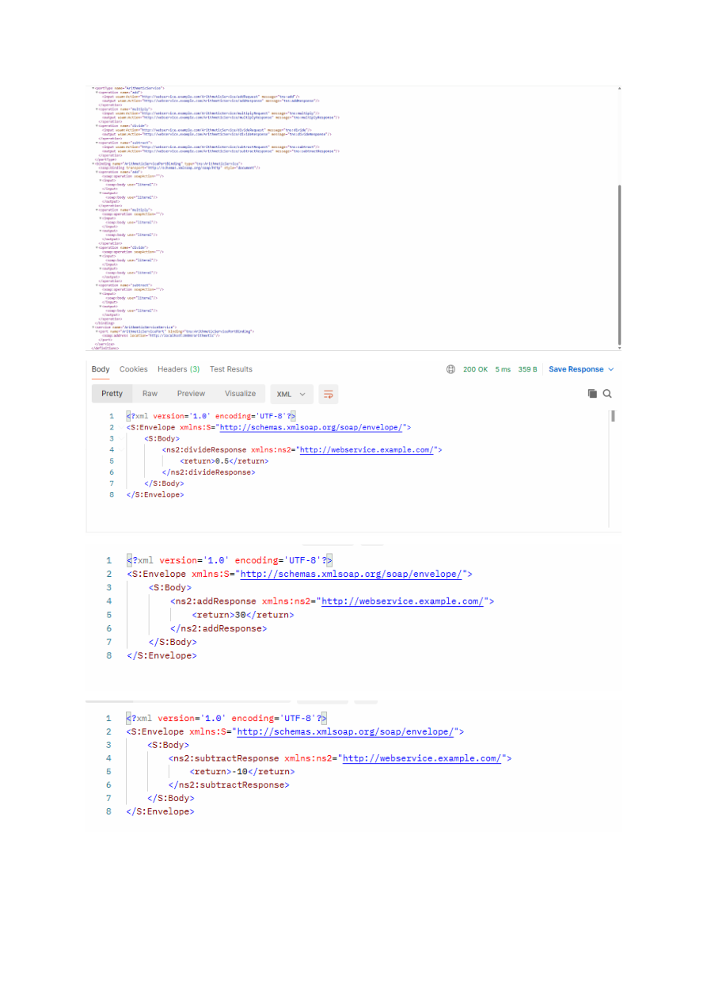
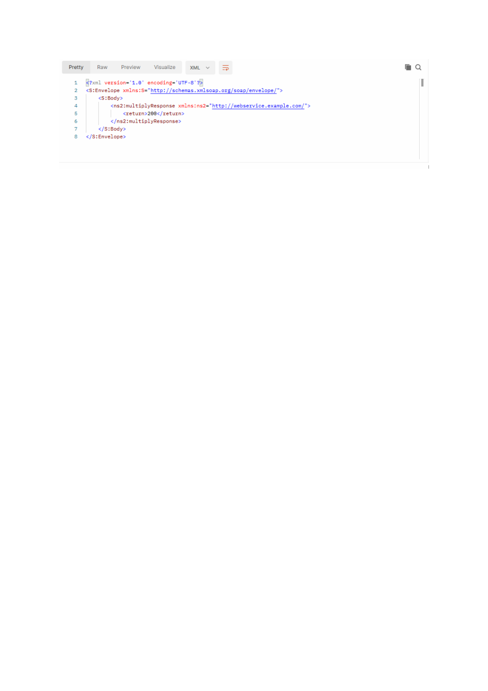

# Web Services Practical 2

**Name:** Gayatri Kanodia  
**Roll No.:** 31010924802  
**Class:** TYIT  
**Subject:** Web Services (Practical)

## Practical 2

### Aim

To create and publish a SOAP web service for arithmetic operations such as addition, subtraction, multiplication and division.

---

## Files

- `pom.xml` — Maven configuration and dependencies.
- `ArithmeticService.java` — SOAP web service containing arithmetic methods.
- `Publisher.java` — Publishes the service at `http://localhost:8080/arithmetic`.
- `soap_body.xml` — SOAP request body used for the divide operation.
- `page_3.png` — Screenshot from the submitted practical (SOAP header and code).
- `page_4.png` — Screenshot from the submitted practical (SOAP body and output).
- `page_5.png` — Screenshot from the submitted practical (SOAP responses).
- `page_6.png` — Screenshot from the submitted practical (multiply response).

---

## 1. pom.xml

```xml
<?xml version="1.0" encoding="UTF-8"?>
<project xmlns="http://maven.apache.org/POM/4.0.0"
xmlns:xsi="http://www.w3.org/2001/XMLSchema-instance"
xsi:schemaLocation="http://maven.apache.org/POM/4.0.0
http://maven.apache.org/xsd/maven-4.0.0.xsd">
<modelVersion>4.0.0</modelVersion>
<groupId>org.example</groupId>
<artifactId>ArithmeticWebService</artifactId>
<version>1.0-SNAPSHOT</version>
<properties>
<maven.compiler.source>17</maven.compiler.source>
<maven.compiler.target>17</maven.compiler.target>
<project.build.sourceEncoding>UTF-8</project.build.sourceEncoding>
</properties>
<dependencies>
<dependency>
<groupId>jakarta.jws</groupId>
<artifactId>jakarta.jws-api</artifactId>
<version>3.0.0</version>
</dependency>
<dependency>
<groupId>com.sun.xml.ws</groupId>
<artifactId>jaxws-rt</artifactId>
<version>4.0.2</version>
</dependency>
</dependencies>
</project>

```

---

## 2. ArithmeticService.java

```java
package com.example.webservice;

import jakarta.jws.*;

@WebService
public class ArithmeticService {

    @WebMethod
    public int add(int a, int b) {
        return a + b;
    }

    @WebMethod
    public int subtract(int a, int b) {
        return a - b;
    }

    @WebMethod
    public int multiply(int a, int b) {
        return a * b;
    }

    @WebMethod
    public double divide(int a, int b) {
        return (double)a / b;
    }
}

```

---

## 3. Publisher.java

```java
package com.example.webservice;

import jakarta.xml.ws.Endpoint;

public class Publisher {
    public static void main(String[] args) {
        Endpoint.publish("http://localhost:8080/arithmetic", new ArithmeticService());
        System.out.println("Arithmetic Web Service Running...");
    }
}

```

---

## 4. SOAP Body

```xml
<?xml version="1.0" encoding="UTF-8"?>
<soapenv:Envelope
    xmlns:soapenv="http://schemas.xmlsoap.org/soap/envelope/"
    xmlns:tns="http://webservice.example.com/">
    <soapenv:Header/>
    <soapenv:Body>
        <tns:divide>
            <arg0>10</arg0>
            <arg1>20</arg1>
        </tns:divide>
    </soapenv:Body>
</soapenv:Envelope>

```

The submitted practical uses `10` and `20` as the arguments for the `divide` operation.

---

## 5. Output / Practical Screenshots

### SOAP Header and Publisher Code



### SOAP Body and Output



### SOAP Responses



### Multiply Response


