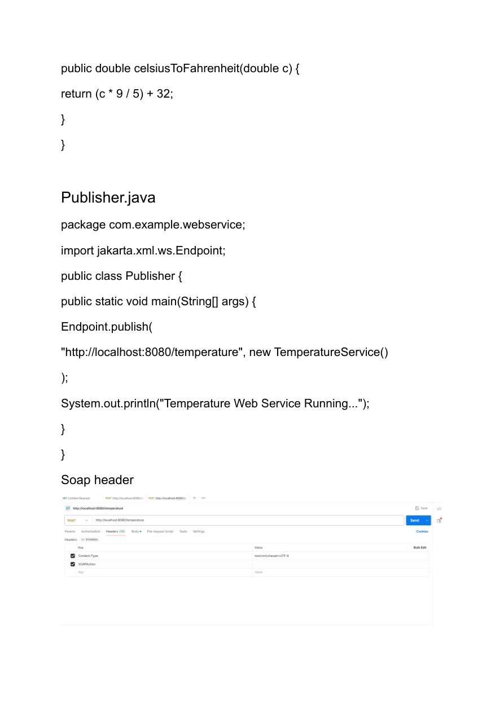
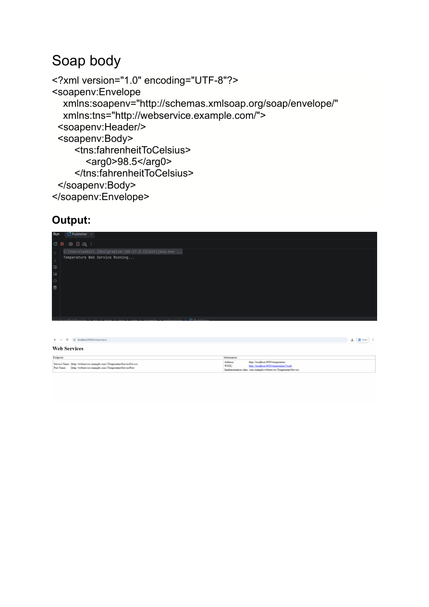
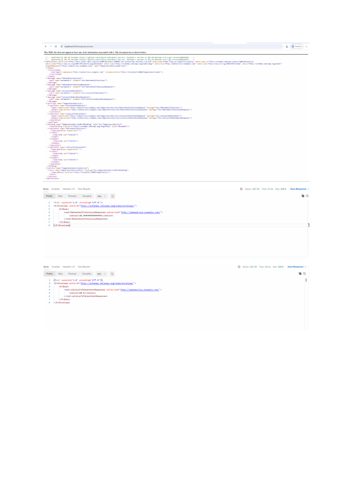

# Web Services Practical 3

**Name:** Gayatri Kanodia\
**Roll No.:** 31010924802\
**Class:** TYIT\
**Subject:** Web Services (Practical)

------------------------------------------------------------------------

# Practical 3 

## Aim

To create and publish a SOAP Web Service for temperature conversion
between Fahrenheit and Celsius.

------------------------------------------------------------------------

## 1. pom.xml

The `pom.xml` file contains the Maven project configuration and
dependencies required for the SOAP Web Service.

``` xml
<?xml version="1.0" encoding="UTF-8"?>
<project xmlns="http://maven.apache.org/POM/4.0.0"
xmlns:xsi="http://www.w3.org/2001/XMLSchema-instance"
xsi:schemaLocation="http://maven.apache.org/POM/4.0.0
http://maven.apache.org/xsd/maven-4.0.0.xsd">

<modelVersion>4.0.0</modelVersion>

<groupId>org.example</groupId>
<artifactId>ArithmeticWebService</artifactId>
<version>1.0-SNAPSHOT</version>

<properties>
<maven.compiler.source>17</maven.compiler.source>
<maven.compiler.target>17</maven.compiler.target>
<project.build.sourceEncoding>UTF-8</project.build.sourceEncoding>
</properties>

<dependencies>

<dependency>
<groupId>jakarta.jws</groupId>
<artifactId>jakarta.jws-api</artifactId>
<version>3.0.0</version>
</dependency>

<dependency>
<groupId>com.sun.xml.ws</groupId>
<artifactId>jaxws-rt</artifactId>
<version>4.0.2</version>
</dependency>

</dependencies>

</project>
```

------------------------------------------------------------------------

## 2. TemperatureService.java

The `TemperatureService` provides two web service operations:

-   Fahrenheit to Celsius
-   Celsius to Fahrenheit

``` java
package com.example.webservice;

import jakarta.jws.*;

@WebService
public class TemperatureService {

    @WebMethod
    public double fahrenheitToCelsius(double f) {
        return (f - 32) * 5 / 9;
    }

    @WebMethod
    public double celsiusToFahrenheit(double c) {
        return (c * 9 / 5) + 32;
    }
}
```

------------------------------------------------------------------------

## 3. Publisher.java

The `Publisher` class publishes the Temperature Web Service.

``` java
package com.example.webservice;

import jakarta.xml.ws.Endpoint;

public class Publisher {
    public static void main(String[] args) {
        Endpoint.publish(
            "http://localhost:8080/temperature",
            new TemperatureService()
        );

        System.out.println("Temperature Web Service Running...");
    }
}
```

The service is published at:

``` text
http://localhost:8080/temperature
```

------------------------------------------------------------------------

## 4. SOAP Body

The following SOAP request calls the `fahrenheitToCelsius` operation
using the value `98.5`.

``` xml
<?xml version="1.0" encoding="UTF-8"?>
<soapenv:Envelope
    xmlns:soapenv="http://schemas.xmlsoap.org/soap/envelope/"
    xmlns:tns="http://webservice.example.com/">

    <soapenv:Header/>

    <soapenv:Body>
        <tns:fahrenheitToCelsius>
            <arg0>98.5</arg0>
        </tns:fahrenheitToCelsius>
    </soapenv:Body>

</soapenv:Envelope>
```

------------------------------------------------------------------------

# 5. Output Screenshots

## SOAP Header



------------------------------------------------------------------------

## SOAP Body and Output



------------------------------------------------------------------------

## SOAP Response



------------------------------------------------------------------------

# 6. Files Included

``` text
Practical 3
│
├── pom.xml
├── soap_body.xml
├── page_3.png
├── page_4.png
├── page_5.png
│
└── com
    └── example
        └── webservice
            ├── TemperatureService.java
            └── Publisher.java
```

------------------------------------------------------------------------

# Result

The Temperature SOAP Web Service was created and published successfully.
It provides operations for converting Fahrenheit to Celsius and Celsius
to Fahrenheit.
