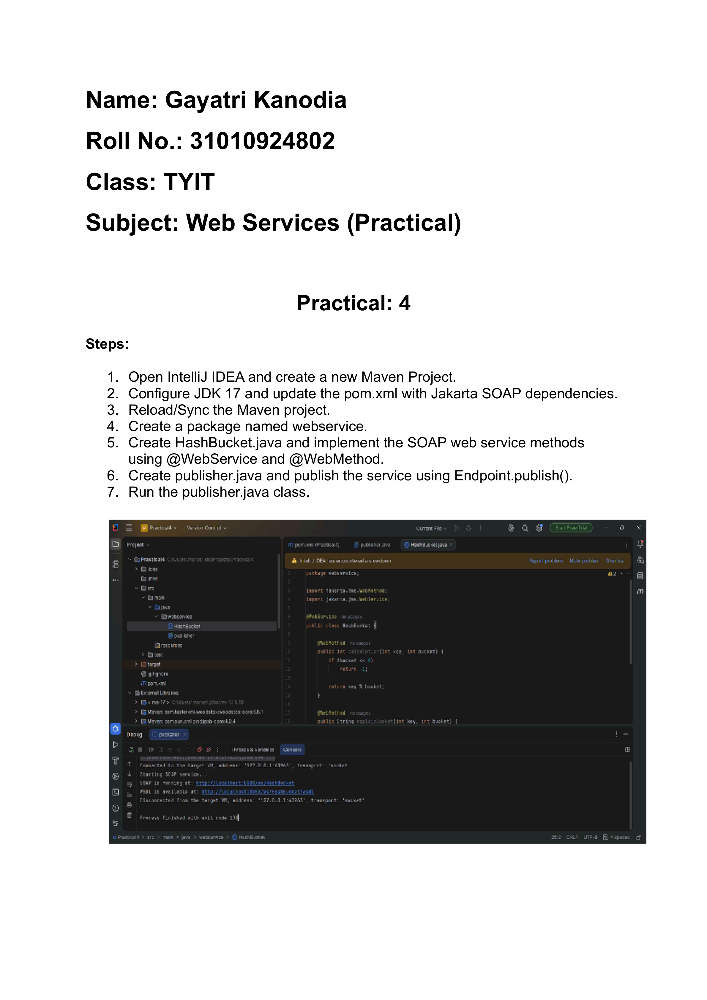
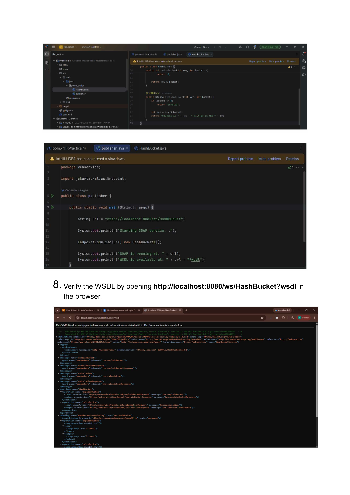

# Web Services Practical 4

**Name:** Gayatri Kanodia\
**Roll No.:** 31010924802\
**Class:** TYIT\
**Subject:** Web Services (Practical)

------------------------------------------------------------------------

# Practical 4

## Aim

To create and publish a SOAP Web Service for hash bucket calculation.

------------------------------------------------------------------------

## 1. HashBucket.java

The `HashBucket` class is the SOAP Web Service implementation. It
provides methods for calculating a bucket value and explaining which
bucket a student will be placed in.

``` java
package webservice;

import jakarta.jws.WebMethod;
import jakarta.jws.WebService;

@WebService
public class HashBucket {

    @WebMethod
    public int calculation(int key, int bucket) {
        if (bucket <= 0) {
            return -1;
        }

        return key % bucket;
    }

    @WebMethod
    public String explainBucket(int key, int bucket) {
        if (bucket <= 0) {
            return "Invalid";
        }

        int buc = key % bucket;
        return "Student " + key + " will be in the " + buc + " buc";
    }
}
```

------------------------------------------------------------------------

## 2. publisher.java

The `publisher` class publishes the HashBucket SOAP Web Service using
the following endpoint:

``` text
http://localhost:8080/ws/HashBucket
```

``` java
package webservice;

import jakarta.xml.ws.Endpoint;

public class publisher {

    public static void main(String[] args) {

        Endpoint.publish(
            "http://localhost:8080/ws/HashBucket",
            new HashBucket()
        );

        System.out.println("HashBucket Web Service Running...");
    }
}
```

------------------------------------------------------------------------

## 3. Maven Configuration

The Maven project is configured to use JDK 17 and the Jakarta Web
Services dependencies required for the SOAP Web Service.

The project contains:

``` text
pom.xml
```

------------------------------------------------------------------------

## 4. Web Service Endpoint

The HashBucket Web Service is published at:

``` text
http://localhost:8080/ws/HashBucket
```

The WSDL can be accessed using:

``` text
http://localhost:8080/ws/HashBucket?wsdl
```

------------------------------------------------------------------------

# 5. Output Screenshots

## Project and HashBucket Web Service



------------------------------------------------------------------------

## WSDL / Web Service Output



------------------------------------------------------------------------


