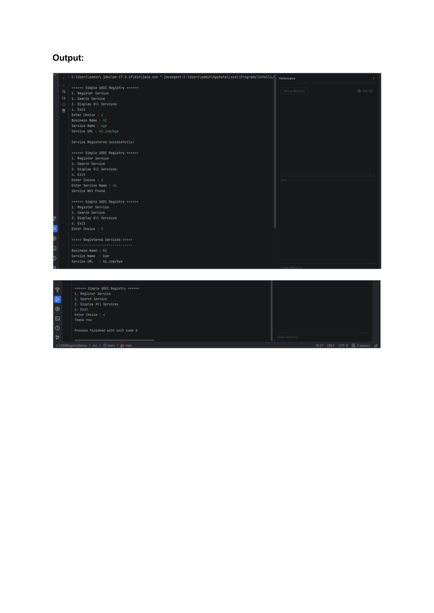

# Web Services Practical 5

**Name:** Gayatri Kanodia\
**Roll No.:** 31010924802\
**Class:** TYIT\
**Subject:** Web Services (Practical)

------------------------------------------------------------------------

# Practical 5

## Aim

Build a simple UDDI Registry in Java.

------------------------------------------------------------------------

## 1. ServiceInfo.java

``` java
public class ServiceInfo {

    private String serviceName;
    private String businessName;
    private String serviceURL;

    public ServiceInfo(String serviceName, String businessName, String serviceURL) {
        this.serviceName = serviceName;
        this.businessName = businessName;
        this.serviceURL = serviceURL;
    }

    public String getServiceName() {
        return serviceName;
    }

    public String getBusinessName() {
        return businessName;
    }

    public String getServiceURL() {
        return serviceURL;
    }

    @Override
    public String toString() {
        return "Business Name : " + businessName +
               "\nService Name : " + serviceName +
               "\nService URL : " + serviceURL;
    }
}
```

------------------------------------------------------------------------

## 2. UDDIRegistry.java

``` java
import java.util.ArrayList;

public class UDDIRegistry {

    private ArrayList<ServiceInfo> services = new ArrayList<>();

    // Register a new service
    public void registerService(ServiceInfo service) {
        services.add(service);
        System.out.println("\nService Registered Successfully!");
    }

    // Search service by name
    public ServiceInfo findService(String serviceName) {
        for (ServiceInfo service : services) {
            if (service.getServiceName().equalsIgnoreCase(serviceName)) {
                return service;
            }
        }

        return null;
    }

    // Display all registered services
    public void displayServices() {
        if (services.isEmpty()) {
            System.out.println("No Services Registered.");
            return;
        }

        System.out.println("\n===== Registered Services =====");

        for (ServiceInfo service : services) {
            System.out.println("-------------------------------");
            System.out.println(service);
        }
    }
}
```

------------------------------------------------------------------------

## 3. Main.java

``` java
import java.util.Scanner;

public class Main {

    public static void main(String[] args) {

        Scanner sc = new Scanner(System.in);
        UDDIRegistry registry = new UDDIRegistry();

        int choice;

        do {

            System.out.println("\n====== Simple UDDI Registry ======");
            System.out.println("1. Register Service");
            System.out.println("2. Search Service");
            System.out.println("3. Display All Services");
            System.out.println("4. Exit");

            System.out.print("Enter Choice : ");
            choice = sc.nextInt();
            sc.nextLine();

            switch (choice) {

                case 1:

                    System.out.print("Business Name : ");
                    String business = sc.nextLine();

                    System.out.print("Service Name : ");
                    String service = sc.nextLine();

                    System.out.print("Service URL : ");
                    String url = sc.nextLine();

                    registry.registerService(
                        new ServiceInfo(service, business, url)
                    );

                    break;

                case 2:

                    System.out.print("Enter Service Name : ");
                    String search = sc.nextLine();

                    ServiceInfo result = registry.findService(search);

                    if (result != null) {
                        System.out.println("\nService Found");
                        System.out.println(result);
                    } else {
                        System.out.println("Service Not Found");
                    }

                    break;

                case 3:

                    registry.displayServices();

                    break;

                case 4:

                    System.out.println("Thank You");

                    break;

                default:

                    System.out.println("Invalid Choice");
            }

        } while (choice != 4);

        sc.close();
    }
}
```

------------------------------------------------------------------------

## 4. Output

The output demonstrates the Simple UDDI Registry menu, registering a
service, displaying the registered service, and exiting the program.



------------------------------------------------------------------------

