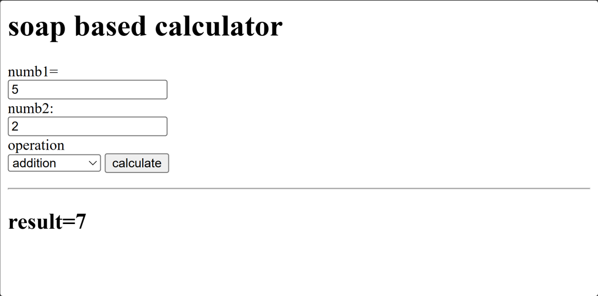

# Web Services Practical 6

**Name:** Gayatri Kanodia\
**Roll No.:** 31010924802\
**Class:** TYIT\
**Subject:** Web Services (Practical)

------------------------------------------------------------------------

# Practical 6

## Aim

To create a SOAP based calculator web application.

------------------------------------------------------------------------

## 1. pom.xml

The project uses Maven, Java 17, WAR packaging, and the Jakarta Servlet
API.

``` xml
<?xml version="1.0" encoding="UTF-8"?>

<project xmlns="http://maven.apache.org/POM/4.0.0"
         xmlns:xsi="http://www.w3.org/2001/XMLSchema-instance"
         xsi:schemaLocation="http://maven.apache.org/POM/4.0.0
         http://maven.apache.org/xsd/maven-4.0.0.xsd">

    <modelVersion>4.0.0</modelVersion>

    <groupId>org.example</groupId>
    <artifactId>prac6</artifactId>
    <version>1.0-SNAPSHOT</version>

    <packaging>war</packaging>

    <properties>
        <maven.compiler.source>17</maven.compiler.source>
        <maven.compiler.target>17</maven.compiler.target>
        <project.build.sourceEncoding>UTF-8</project.build.sourceEncoding>
    </properties>

    <dependencies>

        <dependency>
            <groupId>jakarta.servlet</groupId>
            <artifactId>jakarta.servlet-api</artifactId>
            <version>6.0.0</version>
            <scope>provided</scope>
        </dependency>

    </dependencies>

</project>
```

------------------------------------------------------------------------

## 2. index.jsp

The JSP page provides input fields for two numbers and an operation. The
available operations are addition, subtraction, multiplication and
division.

``` jsp
<%@ page contentType="text/html;charset=UTF-8" language="java" %>

<html>
<head>
    <title>calculator</title>
</head>

<body>

<h1>soap based calculator</h1>

<form method="post" action="calculate">

    numb1:<br>
    <input type="number" name="num1" required>
    <br>

    numb2:<br>
    <input type="number" name="num2" required>
    <br>

    operation<br>

    <select name="operation">
        <option value="add">addition</option>
        <option value="subtract">subtraction</option>
        <option value="multiply">multiplication</option>
        <option value="divide">division</option>
    </select>

    <input type="submit" value="calculate">

</form>

<%
    String result = (String) request.getAttribute("result");

    if (result != null) {
%>

<hr>

<h2>result=<%=result%></h2>

<%
    }
%>

</body>
</html>
```

------------------------------------------------------------------------

## 3. SOAPClient.java

The SOAP client creates a SOAP request and sends it to the arithmetic
web service using an HTTP POST request.

``` java
package com.example.client;

import java.io.*;
import java.net.HttpURLConnection;
import java.net.*;

public class SOAPClient {

    public static String callService(int a, int b, String operation) throws Exception {

        String soap = "<?xml version=\"1.0\" encoding=\"UTF-8\"?>" +
                "<soapenv:Envelope " +
                "xmlns:soapenv=\"http://schemas.xmlsoap.org/soap/envelope/\" " +
                "xmlns:tns=\"http://webservice.example.com/\">" +
                "<soapenv:Header/>" +
                "<soapenv:Body>" +
                "<tns:" + operation + ">" +
                "<arg0>" + a + "</arg0>" +
                "<arg1>" + b + "</arg1>" +
                "</tns:" + operation + ">" +
                "</soapenv:Body>" +
                "</soapenv:Envelope>";

        URL url = new URL("http://localhost:8080/arithmetic");

        HttpURLConnection connection =
                (HttpURLConnection) url.openConnection();

        connection.setRequestMethod("POST");
        connection.setDoOutput(true);
        connection.setRequestProperty(
                "Content-Type",
                "text/xml;charset=UTF-8"
        );

        OutputStream os = connection.getOutputStream();

        os.write(soap.getBytes());
        os.flush();

        BufferedReader br =
                new BufferedReader(
                        new InputStreamReader(
                                connection.getInputStream()
                        )
                );

        String line;
        StringBuilder response = new StringBuilder();

        while ((line = br.readLine()) != null) {
            response.append(line);
        }

        br.close();

        return response.toString();
    }
}
```

------------------------------------------------------------------------

## 4. Servlet.java

The servlet receives the values from the JSP form, calls the SOAP
client, extracts the result from the SOAP response and forwards it back
to `index.jsp`.

``` java
package com.example.client;

import jakarta.servlet.annotation.WebServlet;
import jakarta.servlet.http.*;
import jakarta.servlet.*;
import java.io.*;

@WebServlet("/calculate")
public class Servlet extends HttpServlet {

    @Override
    protected void doPost(HttpServletRequest request,
                           HttpServletResponse response)
            throws ServletException, IOException {

        int a = Integer.parseInt(request.getParameter("num1"));
        int b = Integer.parseInt(request.getParameter("num2"));
        String operation = request.getParameter("operation");

        try {
            String xml = SOAPClient.callService(a, b, operation);

            int start = xml.indexOf("<return>");
            start = xml.indexOf(">", start) + 1;

            int end = xml.indexOf("</return>");

            String result = xml.substring(start, end).trim();

            request.setAttribute("result", result);

        } catch (Exception e) {
            request.setAttribute("result", e.getMessage());
        }

        request.getRequestDispatcher("index.jsp")
               .forward(request, response);
    }
}
```

------------------------------------------------------------------------

## 5. SOAP Service Endpoint

The SOAP client sends the request to:

``` text
http://localhost:8080/arithmetic
```

------------------------------------------------------------------------

## 6. Output Screenshot



------------------------------------------------------------------------

