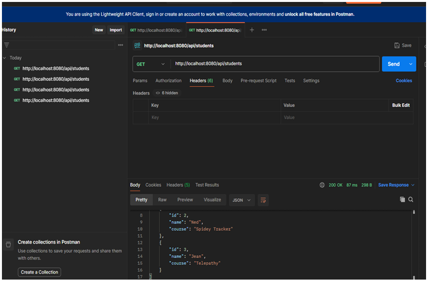
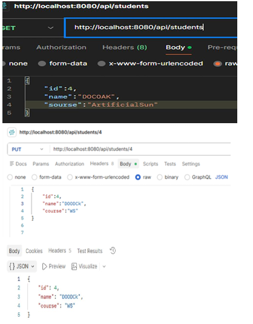
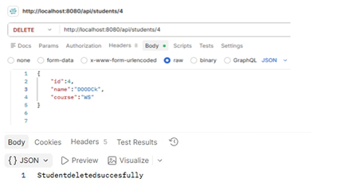
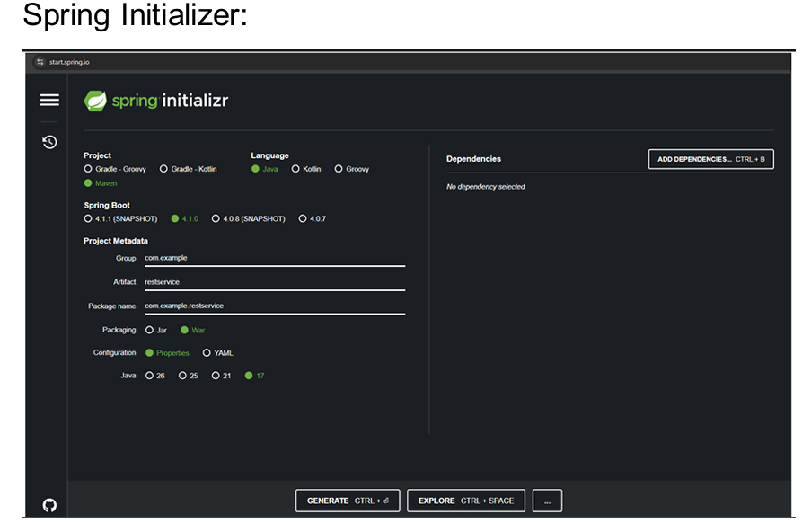

# Web Services Practical 7

**Name:** Gayatri Kanodia  
**Roll No.:** 31010924802  
**Class:** TYIT  
**Subject:** Web Services (Practical)

---

# Practical 7

## Aim

To create a RESTful Web Service using Spring Boot and perform CRUD operations using Postman.

---

## 1. HelloController1.java

This controller provides a simple REST endpoint that returns `Hello World`.

```java
package com.example.restservice;

import org.springframework.web.bind.annotation.GetMapping;
import org.springframework.web.bind.annotation.RestController;

@RestController
public class HelloController1 {

    @GetMapping("/api/hello")
    public String hello() {
        return "Hello World";
    }
}
```

### Endpoint

```text
GET /api/hello
```

---

## 2. Stud.java

The `Stud` class represents a student with the following properties:

- ID
- Name
- Course

```java
package com.example.restservice;

public class Stud {

    private int id;
    private String name;
    private String course;

    public Stud() {
    }

    public Stud(int id, String name, String course) {
        this.id = id;
        this.name = name;
        this.course = course;
    }

    public int getId() {
        return id;
    }

    public void setId(int id) {
        this.id = id;
    }

    public String getName() {
        return name;
    }

    public void setName(String name) {
        this.name = name;
    }

    public String getCourse() {
        return course;
    }

    public void setSource(String course) {
        this.course = course;
    }
}
```

---

## 3. StudentController.java

`StudentController` provides REST APIs for managing student records.

Initial student records:

```text
1 - Peter - Arcanide DNA
2 - Ned - Spidey Tracker
3 - Jean - Telepathy
```

### GET All Students

```text
GET /api/students
```

Returns the list of all students.

### GET Student by ID

```text
GET /api/students/{id}
```

Returns a student based on the given ID.

### POST Student

```text
POST /api/students
```

Adds a new student using the request body.

Example:

```json
{
    "id": 4,
    "name": "Tony",
    "course": "AI"
}
```

### PUT Student

```text
PUT /api/students/{id}
```

Updates an existing student's name and course.

### DELETE Student

```text
DELETE /api/students/{id}
```

Deletes the student with the specified ID.

---

## 4. Output Screenshots

### POST Request



### PUT Request



### DELETE Request



### Spring Intializr Output



---

