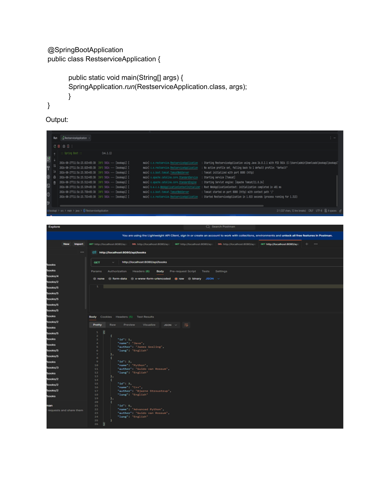
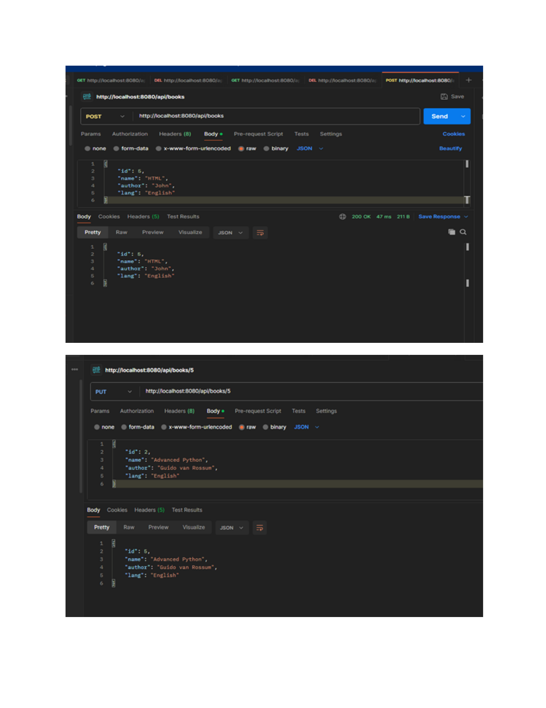

# Web Services Practical 8

**Name:** Gayatri Kanodia  
**Roll No.:** 31010924802  
**Class:** TYIT  
**Subject:** Web Services (Practical)

---

# Practical 8

## Aim

To create a RESTful Web Service using Spring Boot for performing CRUD operations on book records.

---

## 1. Book.java

The `Book` class contains the following properties:

- ID
- Name
- Author
- Language

```java
package com.example.bookapi;

public class Book {

    private int id;
    private String name;
    private String author;
    private String lang;

    public Book() {
    }

    public Book(int id, String name, String author, String lang) {
        this.id = id;
        this.name = name;
        this.author = author;
        this.lang = lang;
    }

    public int getId() {
        return id;
    }

    public void setId(int id) {
        this.id = id;
    }

    public String getName() {
        return name;
    }

    public void setName(String name) {
        this.name = name;
    }

    public String getAuthor() {
        return author;
    }

    public void setAuthor(String author) {
        this.author = author;
    }

    public String getLang() {
        return lang;
    }

    public void setLang(String lang) {
        this.lang = lang;
    }
}
```

---

## 2. bookcontroller.java

The controller manages book records through REST API endpoints.

Three initial books are added:

```text
1 - Java Programming - James Gosling - English
2 - Spring Boot - Rod Johnson - English
3 - Python Basics - Guido van Rossum - English
```

### GET All Books

```text
GET /api/books
```

Returns all books.

### GET Book by ID

```text
GET /api/books/{id}
```

Returns a book using its ID.

### POST Book

```text
POST /api/books
```

Adds a new book.

### PUT Book

```text
PUT /api/books/{id}
```

Updates an existing book's name, author and language.

### DELETE Book

```text
DELETE /api/books/{id}
```

Deletes a book record.

---

## 3. RestserviceApplication.java

This is the main Spring Boot application class.

```java
package com.example.restservice;

import org.springframework.boot.SpringApplication;
import org.springframework.boot.autoconfigure.SpringBootApplication;

@SpringBootApplication
public class RestserviceApplication {

    public static void main(String[] args) {
        SpringApplication.run(RestserviceApplication.class, args);
    }
}
```

---

## 4. REST API Operations

The practical demonstrates the following CRUD operations:

| Operation | HTTP Method | Endpoint |
|---|---|---|
| Get all books | GET | `/api/books` |
| Get book by ID | GET | `/api/books/{id}` |
| Add book | POST | `/api/books` |
| Update book | PUT | `/api/books/{id}` |
| Delete book | DELETE | `/api/books/{id}` |

---

## 5. Output Screenshots

### Output Screenshot 1



### Output Screenshot 2



---

