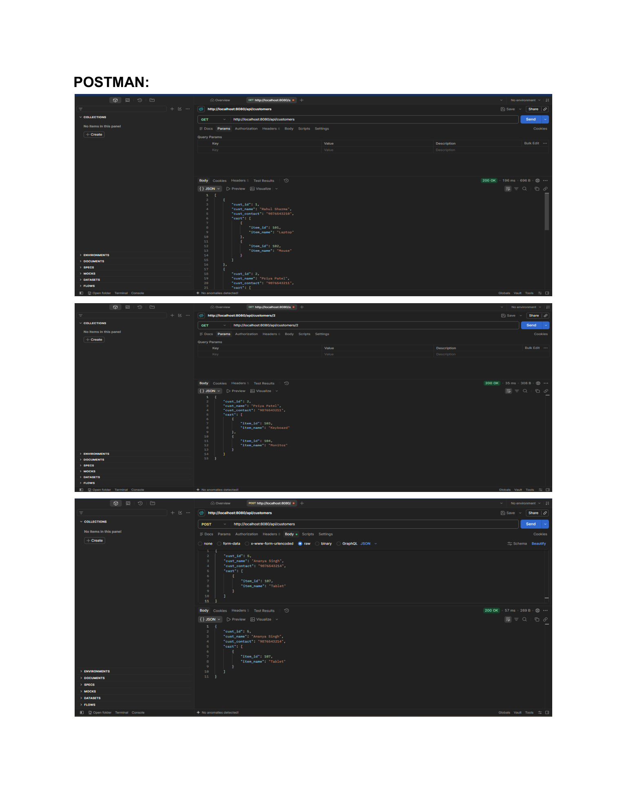
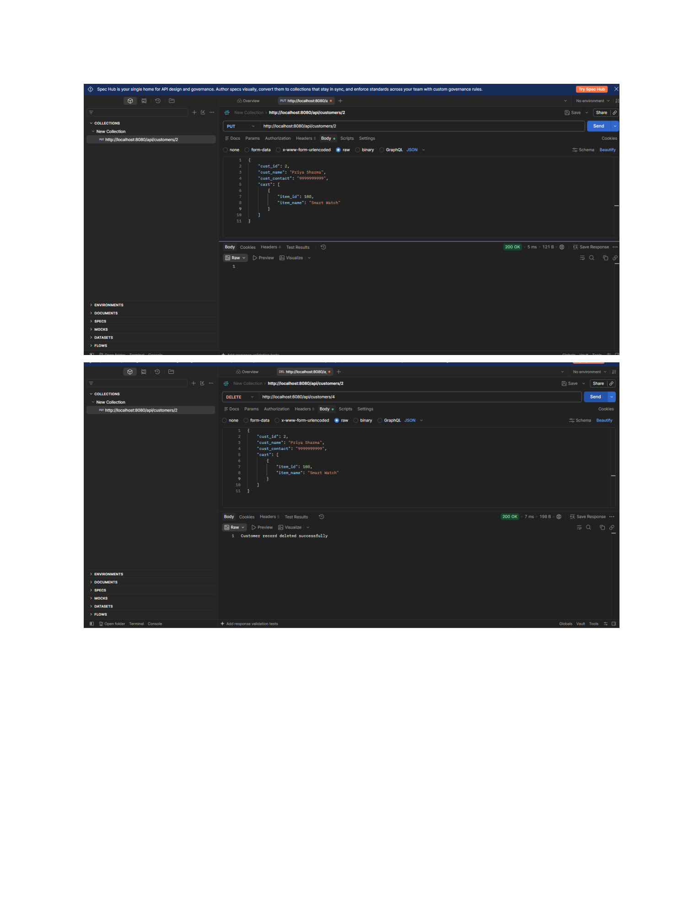

# Web Services Practical 9

**Name:** Gayatri Kanodia  
**Roll No.:** 31010924802  
**Subject:** Web Services (Practicals)

---

# Practical 9

## Aim

To create a RESTful Web Service using Spring Boot for managing customer records and their cart items.

---

## 1. CustomerApiApplication.java

```java
package com.example.customerapi;

import org.springframework.boot.SpringApplication;
import org.springframework.boot.autoconfigure.SpringBootApplication;

@SpringBootApplication
public class CustomerApiApplication {

    public static void main(String[] args) {
        SpringApplication.run(CustomerApiApplication.class, args);
    }
}
```

---

## 2. CartItem.java

```java
package com.example.customerapi;

public class CartItem {

    private int item_id;
    private String item_name;

    public CartItem() {
    }

    public CartItem(int item_id, String item_name) {
        this.item_id = item_id;
        this.item_name = item_name;
    }

    public int getItem_id() {
        return item_id;
    }

    public void setItem_id(int item_id) {
        this.item_id = item_id;
    }

    public String getItem_name() {
        return item_name;
    }

    public void setItem_name(String item_name) {
        this.item_name = item_name;
    }
}
```

---

## 3. Customer.java

The `Customer` class contains customer ID, customer name, customer contact and a list of cart items.

```java
package com.example.customerapi;

import java.util.List;

public class Customer {

    private int cust_id;
    private String cust_name;
    private String cust_contact;
    private List<CartItem> cart;

    public Customer() {
    }

    public Customer(int cust_id, String cust_name, String cust_contact,
                    List<CartItem> cart) {
        this.cust_id = cust_id;
        this.cust_name = cust_name;
        this.cust_contact = cust_contact;
        this.cart = cart;
    }

    public int getCust_id() {
        return cust_id;
    }

    public void setCust_id(int cust_id) {
        this.cust_id = cust_id;
    }

    public String getCust_name() {
        return cust_name;
    }

    public void setCust_name(String cust_name) {
        this.cust_name = cust_name;
    }

    public String getCust_contact() {
        return cust_contact;
    }

    public void setCust_contact(String cust_contact) {
        this.cust_contact = cust_contact;
    }

    public List<CartItem> getCart() {
        return cart;
    }

    public void setCart(List<CartItem> cart) {
        this.cart = cart;
    }
}
```

---

## 4. CustomerController.java

The controller provides REST APIs for managing customers.

Initial customer records include:

```text
1 - Rahul Sharma - 9876543210
   Cart: Laptop, Mouse

2 - Priya Patel - 9876543211
   Cart: Keyboard, Monitor

3 - Amit Shah - 9876543212
   Cart: Headphones

4 - Neha Mehta - 9876543213
   Cart: Mobile Phone
```

### GET All Customers

```text
GET /api/customers
```

Returns all customer records.

### GET Customer by ID

```text
GET /api/customers/{id}
```

Returns a customer using the customer ID.

### POST Customer

```text
POST /api/customers
```

Adds a new customer.

### PUT Customer

```text
PUT /api/customers/{id}
```

Updates an existing customer.

### DELETE Customer

```text
DELETE /api/customers/{id}
```

Deletes a customer record.

---

## 5. REST API Operations

| Operation | HTTP Method | Endpoint |
|---|---|---|
| Get all customers | GET | `/api/customers` |
| Get customer by ID | GET | `/api/customers/{id}` |
| Add customer | POST | `/api/customers` |
| Update customer | PUT | `/api/customers/{id}` |
| Delete customer | DELETE | `/api/customers/{id}` |

---

## 6. Output Screenshots

### Postman Output 1



### Postman Output 2



---

